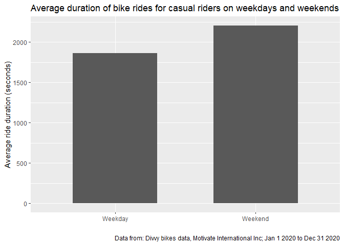
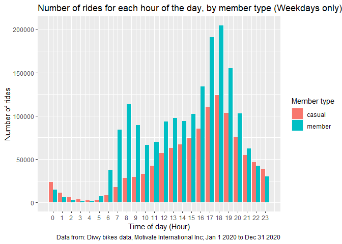

## Background

* The company is a fictional bike-share company based in Chicago, named Cyclistic. The company maintains a fleet of more than 5800 bicycles and 600 docking stations. They set themselves apart by offering different types of bikes such as reclining bikes, hand tricycles, and cargo bikes in order to make bike sharing more inclusive to people with diabilities and other riders who are unable to use a stadard bicycle.
* Cyclistic offers a few options for riders in terms of pricing plans. They offer single-ride passes, full-day passes, and annual memberships. those who purchase annual memberships are referred to as members, the others are referred to as casual riders.
* Cyclistic finance analysts have concluded that annual members are much more profitable than casual riders, and it is believed that maximising the number of annual members will be key to the company's future growth.
* The current marketing strategy revolves around building general awareness and appealing to broad consumer segments.

## Goals/Business tasks

* The goal of the marketing team is to design marketing strategies aimed at converting casual riders into annual members.
* My task is to answer the question: **How do annual members and casual riders use Cyclistic bikes differently?**

## Preparing data

*Data source* previous 12 months (07/2020 to 06/2021) of Cyclistic trip data downloaded from [here](https://divvy-tripdata.s3.amazonaws.com/index.html)

* 12 .csv files.
* 13 variables including start/end station names and ID numbers, rideable types, start and end times etc.

*Notes*

* The datasets have a different name because Cyclistic is a fictional company.
* The data has been made available by Motivate International Inc. under this [license.](https://www.divvybikes.com/data-license-agreement)
* This is public data.
* The data is unbiased, original and is not missing any important information.

## Processing and preparing data

For this analysis I will be using R, making use of the tidyverse, lubridate, broom, and scale packages

```r
#loading necessary packages.
library(tidyverse)
library(lubridate)
library(broom)
library(scales)
```

### Collecting the data and finishing cleaning

I will be importing a .csv file containing the full dataset, that heas been mostly cleaned, and has had a few columns added for ease of use. The process for creating this file can be seen in the file **create_full_csv.R**.

There was some bad data remaining in the dataset (excessively long/short ride lengths) which were removed


```r
#import data
all_trips <- read.csv('all_trips.csv')

#checking structure of all_trips, then changing data types
str(all_trips)
```

```
## 'data.frame':	4449799 obs. of  16 variables:
##  $ X                 : int  1 2 3 4 5 6 7 8 9 10 ...
##  $ ride_id           : Factor w/ 4449799 levels "000001004784CD35",..: 2051309 3315846 3668167 1470279 1458623 1760221 606086 3508517 4378350 2400151 ...
##  $ rideable_type     : Factor w/ 3 levels "classic_bike",..: 2 2 2 2 2 2 2 2 2 2 ...
##  $ started_at        : Factor w/ 3808690 levels "2020-07-01 00:00:14",..: 122929 354510 114555 245878 48053 413207 438183 189267 437544 86431 ...
##  $ ended_at          : Factor w/ 3794021 levels "2020-07-01 00:03:01",..: 122373 353558 113859 245348 47623 412111 437135 188714 436478 85871 ...
##  $ start_station_name: Factor w/ 713 levels "","2112 W Peterson Ave",..: 535 309 368 388 370 260 53 588 141 269 ...
##  $ start_station_id  : int  180 299 329 181 268 635 113 211 176 31 ...
##  $ end_station_name  : Factor w/ 714 levels "","2112 W Peterson Ave",..: 664 64 157 135 154 662 215 270 103 436 ...
##  $ end_station_id    : int  291 461 156 94 301 289 140 31 191 142 ...
##  $ member_casual     : Factor w/ 2 levels "casual","member": 2 2 1 1 2 1 2 2 2 2 ...
##  $ date              : Factor w/ 365 levels "2020-07-01","2020-07-02",..: 9 24 8 17 4 28 30 13 30 6 ...
##  $ month             : Factor w/ 12 levels "April","August",..: 6 6 6 6 6 6 6 6 6 6 ...
##  $ day               : int  9 24 8 17 4 28 30 13 30 6 ...
##  $ year              : int  20 20 20 20 20 20 20 20 20 20 ...
##  $ day_of_week       : Factor w/ 7 levels "Fri","Mon","Sat",..: 5 1 7 1 3 6 5 2 5 2 ...
##  $ ride_length       : int  230 1427 435 1256 308 967 1080 537 876 609 ...
```

```r
#remove x, ride id = chr, rideable_type = chr, started_at = datetime, ended_at = datetime, date = date,
#month = chr, day = chr, year = chr, day_of_Week = chr

all_trips <- all_trips %>%
  mutate(ride_id = as.character(ride_id),
         rideable_type = as.character(rideable_type),
         started_at = as_datetime(started_at),
         ended_at = as_datetime(ended_at),
         date = as.Date(date),
         month = as.character(month),
         day = as.character(day),
         year = as.character(year),
         day_of_week = as.character(day_of_week)) %>%
  select(!(X))

#doing further data cleaning to remove unreasonable ride lengths
#(assuming more than a day, less than 30 seconds would be considered unreasonable)
all_trips %>% summarise(more_than_one_day = sum(ride_length>=86400),
                        less_than_30_secs = sum(ride_length<=30),
                        percentage_removed = percent((more_than_one_day+less_than_30_secs)/nrow(all_trips)))
```

```
##   more_than_one_day less_than_30_secs percentage_removed
## 1              3564             46673                 1%
```

```r
all_trips_v2 <- all_trips %>%
  filter(!(ride_length<=30 | ride_length >= 86400))
```

## Analysis of the data

Starting at a broad level by getting descriptive statistics for ride length for members and casual riders, as well as the number of member uses and casual uses of the service.


```r
#comparing members and casual users
all_trips_v2 %>%
  group_by(member_casual) %>%
  summarise(num_members_casual = n(),
            mean = mean(ride_length), 
            median = median(ride_length),
            max = max(ride_length),
            min = min(ride_length))
```

```
## # A tibble: 2 x 6
##   member_casual num_members_casual  mean median   max   min
##   <fct>                      <int> <dbl>  <int> <int> <int>
## 1 casual                   1905381 2006.   1165 86394    31
## 2 member                   2494181  898.    656 86383    31
```

We can also look at average ride length for members and casual riders for each day of the week.

```r
#change the days of the week to be in order.
all_trips_v2$day_of_week <- ordered(all_trips_v2$day_of_week, levels=c("Sun", "Mon", "Tue", "Wed", "Thu", "Fri", "Sat"))

#average ride time by day for members vs casual users
aggregate(all_trips_v2$ride_length ~ all_trips_v2$member_casual + all_trips_v2$day_of_week, FUN = mean)
```

```
##    all_trips_v2$member_casual all_trips_v2$day_of_week all_trips_v2$ride_length
## 1                      casual                      Sun                2254.2173
## 2                      member                      Sun                1006.5003
## 3                      casual                      Mon                1980.3079
## 4                      member                      Mon                 859.9626
## 5                      casual                      Tue                1840.1560
## 6                      member                      Tue                 850.3706
## 7                      casual                      Wed                1771.6015
## 8                      member                      Wed                 854.3582
## 9                      casual                      Thu                1794.4280
## 10                     member                      Thu                 849.0774
## 11                     casual                      Fri                1914.3091
## 12                     member                      Fri                 886.7376
## 13                     casual                      Sat                2165.3004
## 14                     member                      Sat                 989.8239
```

We can then create a table showing average ride length and number of rides for each day of the week, for members and casual riders.

```r
# analyze ridership data by type and weekday
all_trips_v2 %>% 
  mutate(weekday = wday(started_at, label = TRUE)) %>% 
  group_by(member_casual, weekday) %>% 
  summarise(number_of_rides = n(), average_duration = mean(ride_length)) %>% 
  arrange(member_casual, weekday)
```

```
## # A tibble: 14 x 4
## # Groups:   member_casual [2]
##    member_casual weekday number_of_rides average_duration
##    <fct>         <ord>             <int>            <dbl>
##  1 casual        Sun              362494            2254.
##  2 casual        Mon              206644            1980.
##  3 casual        Tue              201409            1840.
##  4 casual        Wed              212730            1772.
##  5 casual        Thu              209723            1794.
##  6 casual        Fri              277497            1914.
##  7 casual        Sat              434884            2165.
##  8 member        Sun              318364            1007.
##  9 member        Mon              332920             860.
## 10 member        Tue              359430             850.
## 11 member        Wed              384048             854.
## 12 member        Thu              359027             849.
## 13 member        Fri              369492             887.
## 14 member        Sat              370900             990.
```

From this table it can be seen that:

* The number of rides through the week for members is relatively consistent, while for casual riders there are more rides on weekend days.
* The average ride length for members is much lower than the average ride length for casual riders.
* The average ride length for casual riders is higher on weekends.

## Visualising the data

### Number of rides and Average ride length for each day of the week.

```r
#visualise number of rides by rider type
all_trips_v2 %>% 
  mutate(weekday = wday(started_at, label = TRUE)) %>% 
  group_by(member_casual, weekday) %>% 
  summarise(number_of_rides = n()
            ,average_duration = mean(ride_length)) %>% 
  arrange(member_casual, weekday)  %>% 
  ggplot(aes(x = weekday, y = number_of_rides, fill = member_casual)) +
  geom_col(position = "dodge") +
  scale_y_continuous(labels = function(x) format(x, scientific = FALSE)) +
  labs(title = "Number of rides for casual riders vs members for each day of the week",
       caption = "Data from: Divvy bikes data, Motivate International Inc; Jan 1 2020 to Dec 31 2020",
       x = "Day of the week",
       y = "Number of bike rides",
       fill = "Member type")
```

<!-- -->

```r
#Create a visualisation for average ride length.
all_trips_v2 %>% 
  mutate(weekday = wday(started_at, label = TRUE)) %>% 
  group_by(member_casual, weekday) %>% 
  summarise(number_of_rides = n()
            ,average_duration = mean(ride_length)) %>% 
  arrange(member_casual, weekday)  %>% 
  ggplot(aes(x = weekday, y = average_duration, fill = member_casual)) +
  geom_col(position = "dodge") +
  labs(title = "Average duration of bike rides for each day of the week, by member type",
       caption = "Data from: Divvy bikes data, Motivate International Inc; Jan 1 2020 to Dec 31 2020",
       x = "Day of the week",
       y = "Average ride duration (seconds)",
       fill = "Member type")
```

<!-- -->

These two charts show the same thing as the previous table:

* Members tend to have a consistent number of rides for each day while casual riders use the service more on weekends.
* Average ride length for members is much lower than casual riders.
* For casual riders the average ride length peaks on weekends.
* Casual riders appear to use the service more than members on weekends.

It could be useful to find out if the average ride length for casual riders is significantly larger on weekends compared to weekdays.


```r
#creating a new dataset with a weekend true/false column
weekend_or_weekday <- all_trips_v2 %>%
  mutate(weekend_tf = day_of_week %in% c("Sun", "Sat"))

#splitting casual data between weekdays and weekends
casual_weekend <- weekend_or_weekday %>%
  filter(member_casual == "casual" & weekend_tf == "TRUE") %>%
  select(ride_length)
casual_weekday <- weekend_or_weekday %>%
  filter(member_casual == "casual" & weekend_tf == "FALSE") %>%
  select(ride_length)

#plotting average ride length on weekends vs weekdays
weekend_or_weekday %>%
  filter(member_casual == 'casual') %>%
  group_by(weekend_tf) %>%
  summarise(average_duration = mean(ride_length)) %>%
  ggplot(aes(x= weekend_tf, y = average_duration)) +
  geom_col(width = 0.6) +
  scale_x_discrete(labels = c('FALSE' = 'Weekday', 'TRUE'= 'Weekend')) +
  labs(title = "Average duration of bike rides for casual riders on weekdays and weekends",
       caption = "Data from: Divvy bikes data, Motivate International Inc; Jan 1 2020 to Dec 31 2020",
       x = "",
       y = "Average ride duration (seconds)")
```

<!-- -->

```r
#testing significance of the difference between weekdays and weekends
t.test(casual_weekend, casual_weekday, alternative = 'greater')
```

```
## 
## 	Welch Two Sample t-test
## 
## data:  casual_weekend and casual_weekday
## t = 66.387, df = 1674367, p-value < 2.2e-16
## alternative hypothesis: true difference in means is greater than 0
## 95 percent confidence interval:
##  334.1838      Inf
## sample estimates:
## mean of x mean of y 
##  2205.723  1863.049
```

It is clear from the graph that the average ride length for casual riders on weekends is much larger than on weekdays. This is also confirmed by the p-value from the two sample t-test being much lower than the significance level (0.05).

### Number of rides and Average ride length for each month.

```r
#Rider behaviour by month
all_trips_v2$month <- ordered(all_trips_v2$month, levels = c("January", "February", "March", "April",
                                                             "May", "June", "July", "August", "September", "October",
                                                             "November", "December"))


#Creating visualisations for number of rides and average ride length by month
all_trips_v2 %>%
  group_by(member_casual, month) %>%
  summarise(number_of_rides = n()) %>%
  ggplot(aes(x = month, y = number_of_rides, fill = member_casual)) +
  geom_col(position = "dodge") +
  scale_y_continuous(labels = function(x) format(x, scientific = FALSE)) +
  theme(axis.text.x = element_text(angle = 45)) +
  labs(title = "Number of rides for each month, by member type",
       caption = "Data from: Divvy bikes data, Motivate International Inc; Jan 1 2020 to Dec 31 2020",
       x = "Month",
       y = "Number of rides",
       fill = "Member type")
```

<!-- -->

```r
all_trips_v2 %>%
  group_by(member_casual, month) %>%
  summarise(number_of_rides = n(),
            average_duration = mean(ride_length)) %>%
  ggplot(aes(x = month, y = average_duration, fill = member_casual)) +
  geom_col(position = "dodge") +
  theme(axis.text.x = element_text(angle = 45)) +
  labs(title = "Average ride duration for each month, by member type",
       caption = "Data from: Divvy bikes data, Motivate International Inc; Jan 1 2020 to Dec 31 2020",
       x = "Month",
       y = "Average ride duration (seconds)",
       fill = "Member type")
```

<!-- -->

Several insights can be gained from these charts:

* Casual riders' usage of the service starts to increase in the Spring time, and peaks in the Summer months before decreasing when heading into Winter.
* Members tend to follow the same pattern.
* The average ride length for casual riders is fairly consistent throughout the year, but is overall higher in the Summer months.

### Number of rides beginning at each hour of the day.

```r
#creating a plot of number of rides by hour
all_trips_v2 %>%
  group_by(hour_of_day = hour(round_date(started_at, 'hour'))) %>%
  group_by(hour_of_day, member_casual) %>%
  summarise(number_of_rides = n(), .groups = 'drop') %>%
  ggplot(aes(x = hour_of_day, y = number_of_rides, fill = member_casual)) +
  geom_col(position = 'dodge') +
  scale_y_continuous(labels = function(x) format(x, scientific = FALSE)) +
  scale_x_continuous(breaks = 0:23) +
  labs(title = "Number of rides for each hour of the day, by member type",
       caption = "Data from: Divvy bikes data, Motivate International Inc; Jan 1 2020 to Dec 31 2020",
       x = "Time of day (Hour)",
       y = "Number of rides",
       fill = "Member type")
```

<!-- -->

We can see from this chart that:

* The start times for members and casual riders begins to increase in the morning and peaks in the evening before decreasing overnight.
* Casual riders seem to use the service more in the afternoon/evening.
* Members ride start time increases heavily around 7-8am and 5-6pm which could mean that members are mostly using the service to commute to and from work.
* It could be useful to find out if weekday start times are similar in nature to that of the full week, I would guess that casual members would continue to start rides mostly in the afternoon, while it will remain clear that members use the service for commuting to and from work.


```r
#plot of start times on weekdays only.
weekend_or_weekday %>%
  filter(weekend_tf == 'FALSE') %>%
  group_by(hour_of_day = hour(round_date(started_at, 'hour'))) %>%
  group_by(hour_of_day, member_casual) %>%
  summarise(number_of_rides = n(), .groups = 'drop') %>%
  ggplot(aes(x = hour_of_day, y = number_of_rides, fill = member_casual)) +
  geom_col(position = 'dodge') +
  scale_y_continuous(labels = function(x) format(x, scientific = FALSE)) +
  scale_x_continuous(breaks = 0:23) +
  labs(title = "Number of rides for each hour of the day, by member type (Weekdays only)",
       caption = "Data from: Divvy bikes data, Motivate International Inc; Jan 1 2020 to Dec 31 2020",
       x = "Time of day (Hour)",
       y = "Number of rides",
       fill = "Member type")
```

<!-- -->

It is clear from this plot that casual riders do not seem to use the service for commuting which could be something to advertise as it would potentially create new customers wanting to gain a better method of commuting by using the Cyclistic service.

### Most frequently used start and end stations for casual riders.

```r
#finding the most popular start and end stations for casual riders
all_trips_v2 %>%
  group_by(start_station_name, member_casual) %>%
  summarise(number_of_rides = n(), .groups = 'drop') %>%
  filter(start_station_name != "", member_casual == "casual") %>%
  arrange(-number_of_rides) %>%
  head(n = 10) %>%
  ggplot(aes(x = reorder(start_station_name, number_of_rides), y = number_of_rides)) +
  geom_col() +
  scale_y_continuous(labels = function(x) format(x, scientific = FALSE)) +
  coord_flip() +
  labs(title = "Top 10 start stations for casual riders",
       caption = "Data from: Divvy bikes data, Motivate International Inc; Jan 1 2020 to Dec 31 2020",
       x = "Station name",
       y = "Number of rides")
```

<!-- -->

```r
all_trips_v2 %>%
  group_by(end_station_name, member_casual) %>%
  summarise(number_of_rides = n(), .groups = 'drop') %>%
  filter(end_station_name != "", member_casual == "casual") %>%
  arrange(-number_of_rides) %>%
  head(n = 10) %>%
  ggplot(aes(x = reorder(end_station_name, number_of_rides), y = number_of_rides)) +
  geom_col() +
  scale_y_continuous(labels = function(x) format(x, scientific = FALSE)) +
  coord_flip() +
  labs(title = "Top 10 end stations for casual riders",
       caption = "Data from: Divvy bikes data, Motivate International Inc; Jan 1 2020 to Dec 31 2020",
       x = "Station name",
       y = "Number of rides")
```

<!-- -->

Some useful insight can be gained from these charts:

* The top 3 start stations are the same as the top 3 end stations.
* 9 of the top 10 start stations are also in the top 10 end stations.


### Key findings

* Casual riders use the service more, and for longer periods of time during the Summer months, and on weekends in general.
* The afternoon and evening time periods are when the number of casual riders is highest.
* It would appear that casual riders tend to use the service for leisure rides with some using it for commutes etc. while members seem to use the service mostly for work commutes with some leisure rides.

## Reccomended actions

* Potentially offering weekend membership passes, or membership sales on weekends could serve to bring more casual riders into membership
* Advertise membership to casual riders, mainly placing advertsements at heavy traffic starting and ending stations (top 10 possibly).
* Offering a membership discount through Summer or on holiday weekends could be a good way to get more casual riders to sign up for memberships.
* Develop a marketing campaign focussing on the benefits of riding Cyclistic bikes as a way of getting to and from work or other repeat destinations as a way to get casual riders to use the service more, and possibly getting them to sign up for membership.
