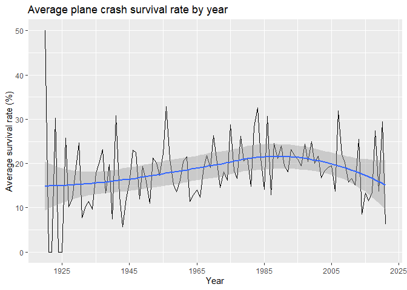
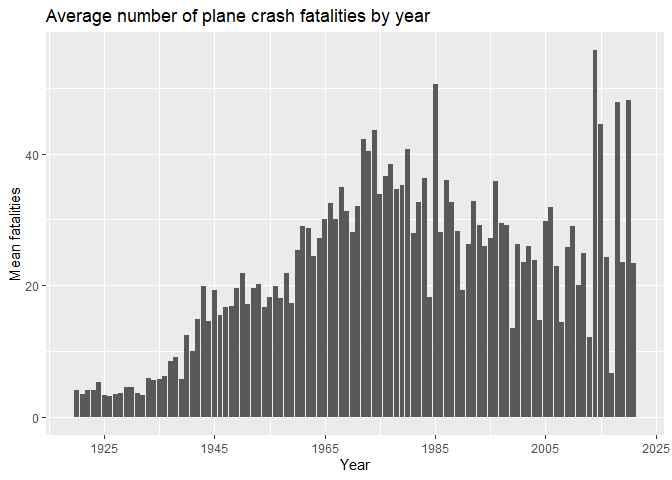
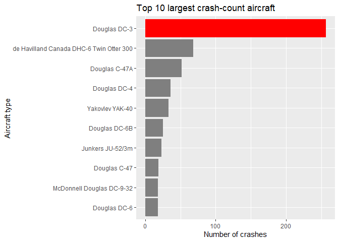
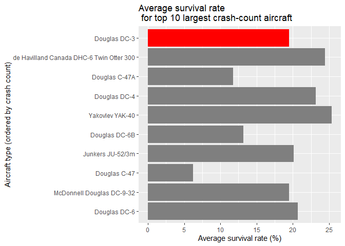

```r
# Loading necessary packages.
library(tidyverse)
library(lubridate)

#reading data.
crash_data <- read.csv("../data/airplane_crashes_dataset_since_1908.csv")
crash_data[crash_data == "?"] <- NA
```

## Background

This project is an analysis of a dataset of recorded plane crashes from 1908 to 2021. It is sourced from [kaggle.com](https://www.kaggle.com/landfallmotto/airplane-crashes-dataset-since-1908), with the data originally being scraped from [planecrashinfo.com](http://www.planecrashinfo.com/). The dataset contains information on individual plane crashes, including information such as the date and time of the crash, location of the crash, the route the plane was taking, as well as the number of people aboard the plane and the number of fatalities for both the crew and passengers. It also has records of the aircraft type, operator, registration number etc.

### Rationale/Goals

I chose to examine this dataset out of personal interest, as I wanted to see if I could find any interesting insights from it, as well as improving my R programming skills.

Initially, I wanted to see if there had been much change in the number of plane crashes per year, as well as seeing if there had been any change in the amount of people surviving plane crashes. I also wanted to find out if the survival rate for more modern planes would be higher when compared to other planes.

My expectations were that there would be less plane crashes happening over time due to increased safety measures in planes as well as just generally having better, less likely to crash, planes being manufactured, I also expected the survival rate for plane crashes to increase, for the same reason. I also expected more modern planes to have a better survival rate.

Along with these questions there were a few other things that appeared during the analysis that I wanted to investigate further that I will go into more detail about later in this report.

## Preparing the data

Before the analysis can begin, I need to ensure that the data is clean and valid. I first need to remove any unnecessary columns, and remove any missing values. 

Checking for any missing values.

```r
colSums(is.na(crash_data))
```

```
##                 date                 time             location 
##                    0                 1504                    5 
##             operator            flight_no                route 
##                   10                 3682                  762 
##              ac_type         registration                cn_ln 
##                   13                  272                  667 
##           all_aboard    passengers_aboard          crew_aboard 
##                   17                  221                  219 
##       all_fatalities passenger_fatalities      crew_fatalities 
##                    8                  235                  235 
##               ground              summary 
##                   44                   59
```
I will be removing a few columns, such as flight number and summary, as I don't need them for the analysis, and will drop the missing values.

```r
crash_data_v2 <- crash_data %>%
  select(-c(time, flight_no, summary)) %>%
  drop_na()

colSums(is.na(crash_data_v2))
```

```
##                 date             location             operator 
##                    0                    0                    0 
##                route              ac_type         registration 
##                    0                    0                    0 
##                cn_ln           all_aboard    passengers_aboard 
##                    0                    0                    0 
##          crew_aboard       all_fatalities passenger_fatalities 
##                    0                    0                    0 
##      crew_fatalities               ground 
##                    0                    0
```

```r
str(crash_data_v2)
```

```
## 'data.frame':	3821 obs. of  14 variables:
##  $ date                : Factor w/ 4577 levels "April 01, 1935",..: 930 4253 791 66 2359 2131 3804 759 3210 669 ...
##  $ location            : Factor w/ 4125 levels "?","1,200 miles off Dakar, Atlantic Ocean",..: 1339 3327 2395 855 3033 2642 4004 752 1728 674 ...
##  $ operator            : Factor w/ 2268 levels "?","46826/109",..: 925 850 2224 705 634 653 713 902 903 267 ...
##  $ route               : Factor w/ 3839 levels ":  Comox-Port Hardy",..: 1906 3751 1217 912 915 3361 3686 3574 2686 2672 ...
##  $ ac_type             : Factor w/ 2469 levels "?","A-7D Corsair",..: 1546 2096 675 1030 343 2094 1050 663 1424 1426 ...
##  $ registration        : Factor w/ 4701 levels "?","? / ?","00-0173",..: 1925 1503 1902 1926 1501 1677 1928 1566 1504 1505 ...
##  $ cn_ln               : Factor w/ 3908 levels ":33105/16357",..: 3774 950 3135 2332 3047 1855 766 766 869 2332 ...
##  $ all_aboard          : Factor w/ 245 levels "?","0","1","10",..: 224 188 102 213 150 188 177 3 201 15 ...
##  $ passengers_aboard   : Factor w/ 235 levels "?","0","1","10",..: 191 167 2 178 96 167 146 2 167 225 ...
##  $ crew_aboard         : Factor w/ 35 levels "?","0","1","10",..: 14 3 14 14 3 3 3 3 14 14 ...
##  $ all_fatalities      : Factor w/ 200 levels "?","0","1","10",..: 133 144 85 168 118 144 133 3 157 3 ...
##  $ passenger_fatalities: Factor w/ 191 levels "?","0","1","10",..: 79 125 2 136 79 125 111 2 125 3 ...
##  $ crew_fatalities     : Factor w/ 29 levels "?","0","1","10",..: 14 3 14 14 3 3 3 3 14 2 ...
##  $ ground              : Factor w/ 52 levels "?","0","1","10",..: 2 2 2 2 2 2 2 2 2 2 ...
```
I now need to change the format of some columns in order to make calculations easier.

```r
crash_data_v2 <- crash_data_v2 %>%
  mutate(date = as.Date(date, format = "%B %d, %Y"),
         all_aboard = as.numeric(as.character(all_aboard)),
         passengers_aboard = as.numeric(as.character(passengers_aboard)),
         crew_aboard = as.numeric(as.character(crew_aboard)),
         all_fatalities = as.numeric(as.character(all_fatalities)),
         passenger_fatalities = as.numeric(as.character(passenger_fatalities)),
         crew_fatalities = as.numeric(as.character(crew_fatalities)),
         ground = as.numeric(as.character(ground))
         )
str(crash_data_v2)
```

```
## 'data.frame':	3821 obs. of  14 variables:
##  $ date                : Date, format: "1920-12-14" "1921-09-06" ...
##  $ location            : Factor w/ 4125 levels "?","1,200 miles off Dakar, Atlantic Ocean",..: 1339 3327 2395 855 3033 2642 4004 752 1728 674 ...
##  $ operator            : Factor w/ 2268 levels "?","46826/109",..: 925 850 2224 705 634 653 713 902 903 267 ...
##  $ route               : Factor w/ 3839 levels ":  Comox-Port Hardy",..: 1906 3751 1217 912 915 3361 3686 3574 2686 2672 ...
##  $ ac_type             : Factor w/ 2469 levels "?","A-7D Corsair",..: 1546 2096 675 1030 343 2094 1050 663 1424 1426 ...
##  $ registration        : Factor w/ 4701 levels "?","? / ?","00-0173",..: 1925 1503 1902 1926 1501 1677 1928 1566 1504 1505 ...
##  $ cn_ln               : Factor w/ 3908 levels ":33105/16357",..: 3774 950 3135 2332 3047 1855 766 766 869 2332 ...
##  $ all_aboard          : num  8 5 2 7 3 5 4 1 6 11 ...
##  $ passengers_aboard   : num  6 4 0 5 2 4 3 0 4 9 ...
##  $ crew_aboard         : num  2 1 2 2 1 1 1 1 2 2 ...
##  $ all_fatalities      : num  4 5 2 7 3 5 4 1 6 1 ...
##  $ passenger_fatalities: num  2 4 0 5 2 4 3 0 4 1 ...
##  $ crew_fatalities     : num  2 1 2 2 1 1 1 1 2 0 ...
##  $ ground              : num  0 0 0 0 0 0 0 0 0 0 ...
```
Now that the data has been correctly formatted, I want to make sure the values for people on the planes, as well as the fatalities, make sense. For example, there could be instances where there is somehow more fatalities than there are people on the plane, or the total fatalities is not equal to the sum of passenger and crew fatalities. These values would obviously be wrong and would need to be corrected.

```r
crash_data_v2 %>% summarise(fatalities_total_wrong = sum(all_fatalities != passenger_fatalities+crew_fatalities),
                            all_aboard_total_wrong = sum(all_aboard != passengers_aboard + crew_aboard),
                            fatalities_more_than_aboard = sum(all_fatalities > all_aboard))
```

```
##   fatalities_total_wrong all_aboard_total_wrong fatalities_more_than_aboard
## 1                     29                     19                           0
```
There are 29 rows where the fatalities do not add up properly, and 19 where the total aboard does not add up properly. From investigating the source website, it would seem that these values were input incorrectly or some other problem that led to them being wrong, as I cannot find the correct values I am going to assume that the totals for people aboard and all fatalities are equal to the sum of passengers and crew aboard and fatalities, respectively.

There are also two row in which values were incorrectly entered, leading to nonsensical data, which will be corrected manually.

```r
#correcting bad data
#correct Dec 29 1974, Tikal Guatemala and April 30 1983, Jacksonville Florida as there is incorrectly entered data
#in the passenger fatalities column
which(crash_data_v2$date == "1974-12-29" & crash_data_v2$location == "Tikal, Guatemala")
crash_data_v2[2002,] <- crash_data_v2[2002,] %>% 
  mutate(passenger_fatalities = 21)

which(crash_data_v2$date == "1983-04-30" & crash_data_v2$location == "Jacksonville, Florida")
crash_data_v2[2344,] <- crash_data_v2[2344,] %>%
  mutate(passenger_fatalities = 9)
```


```r
#assume all others have all_fatalities equal to passenger + crew fatalities due to website having incorrect data
crash_data_v2$all_fatalities <- if_else(crash_data_v2$all_fatalities != crash_data_v2$passenger_fatalities + crash_data_v2$crew_fatalities, 
                                        crash_data_v2$passenger_fatalities + crash_data_v2$crew_fatalities, crash_data_v2$all_fatalities)
crash_data_v2$all_aboard <- if_else(crash_data_v2$all_aboard != crash_data_v2$crew_aboard + crash_data_v2$passengers_aboard,
                                    crash_data_v2$crew_aboard + crash_data_v2$passengers_aboard, crash_data_v2$all_aboard)

crash_data_v2 %>% summarise(fatalities_total_wrong = sum(all_fatalities != passenger_fatalities+crew_fatalities),
                            all_aboard_total_wrong = sum(all_aboard != passengers_aboard + crew_aboard),
                            fatalities_more_than_aboard = sum(all_fatalities > all_aboard))
```

```
##   fatalities_total_wrong all_aboard_total_wrong fatalities_more_than_aboard
## 1                      0                      0                           0
```
The data should now be free of logical issues, so it shopuld be ok to start analysing the data.

## Analysing the data

First, I am going to have a look at a summary of the dataset

```r
summary(crash_data_v2)
```

```
##       date                              location   
##  Min.   :1920-12-14   Moscow, Russia        :  15  
##  1st Qu.:1955-05-21   Manila, Philippines   :  13  
##  Median :1973-03-05   New York, New York    :  12  
##  Mean   :1974-02-23   Rio de Janeiro, Brazil:  11  
##  3rd Qu.:1994-04-04   Sao Paulo, Brazil     :  11  
##  Max.   :2021-07-06   Bogota, Colombia      :  10  
##                       (Other)               :3749  
##                        operator                           route     
##  Aeroflot                  : 224   Training                  :  78  
##  Military - U.S. Air Force :  97   Sightseeing               :  28  
##  Air France                :  58   Test flight               :  18  
##  United Air Lines          :  42   Sao Paulo - Rio de Janeiro:   7  
##  Deutsche Lufthansa        :  38   Rio de Janeiro - Sao Paulo:   5  
##  Pan American World Airways:  36   Test                      :   5  
##  (Other)                   :3326   (Other)                   :3680  
##                                      ac_type         registration 
##  Douglas DC-3                            : 257   12406     :   2  
##  de Havilland Canada DHC-6 Twin Otter 300:  68   CCCP-09303:   2  
##  Douglas C-47A                           :  52   CCCP-46724:   2  
##  Douglas DC-4                            :  36   F-AIUJ    :   2  
##  Yakovlev YAK-40                         :  33   I-BAUS    :   2  
##  Douglas DC-6B                           :  25   N37741    :   2  
##  (Other)                                 :3350   (Other)   :3809  
##      cn_ln        all_aboard     passengers_aboard  crew_aboard    
##  125    :   7   Min.   :  0.00   Min.   :  0.00    Min.   : 0.000  
##  4      :   6   1st Qu.:  8.00   1st Qu.:  4.00    1st Qu.: 2.000  
##  1      :   5   Median : 18.00   Median : 14.00    Median : 4.000  
##  160    :   5   Mean   : 35.31   Mean   : 30.61    Mean   : 4.694  
##  229    :   5   3rd Qu.: 41.00   3rd Qu.: 35.00    3rd Qu.: 6.000  
##  303    :   5   Max.   :644.00   Max.   :614.00    Max.   :61.000  
##  (Other):3788                                                      
##  all_fatalities   passenger_fatalities crew_fatalities      ground        
##  Min.   :  0.00   Min.   :  0.00       Min.   : 0.000   Min.   :   0.000  
##  1st Qu.:  4.00   1st Qu.:  2.00       1st Qu.: 2.000   1st Qu.:   0.000  
##  Median : 12.00   Median :  9.00       Median : 3.000   Median :   0.000  
##  Mean   : 25.07   Mean   : 21.36       Mean   : 3.707   Mean   :   1.963  
##  3rd Qu.: 28.00   3rd Qu.: 24.00       3rd Qu.: 5.000   3rd Qu.:   0.000  
##  Max.   :583.00   Max.   :560.00       Max.   :33.000   Max.   :2750.000  
## 
```
When I first looked at this summary, I noticed that the number of crashes involving the Douglas DC-3 was much larger than any other plane (377% larger than the second highest crash count plane) and decided to investigate this further after I answer my other questions, which are:

**Has the number of plane crashes each year decreased?**

**Has there been any change in the survival rate of plane crashes?**

**How does the survival rate for modern planes compare to other planes?**

and now **Why does the Douglas DC-3 have so many more crashes than other planes?**

In order to answer some of these questions I will need to add a column containing the fatality rate and survival rate for each crash.

```r
crash_data_v2 <- crash_data_v2 %>%
  mutate(fatality_rate = all_fatalities/all_aboard, survival_rate = 1-fatality_rate) %>%
  mutate(fatality_rate = round(fatality_rate, digits = 3), survival_rate = round(survival_rate, digits = 3)) %>%
  mutate(survival_rate = replace(survival_rate, is.nan(survival_rate), 0), fatality_rate = replace(fatality_rate,  is.nan(fatality_rate), 0))
```

### Is the number of plane crashes decreasing?


```r
#plotting number of accidents by year
crash_data_v2 %>%
  mutate(year = year(date)) %>%
  group_by(year) %>%
  summarise(count = n()) %>%
  arrange(year) %>%
  ggplot(aes(x = year, y = count)) +
  geom_col() +
  scale_x_continuous(breaks = seq(1925, 2025, 20)) + 
  labs(title = "Count of plane crashes by year",
       y = "Count of crashes",
       x = "Year")
```

<!-- -->

From the right side of the graph, it can be seen that there is a steady decrease in the number of crashes occuring starting in the late 1990s/early 2000s, with a substantial drop in the early 2010s. This clearly shows that there are less plane crashes occuring each year.

### Has there been any change in the survival rate of plane crashes?


```r
#plotting average survival rate by year
crash_data_v2 %>%
  mutate(year = year(date), survival_rate = survival_rate*100) %>%
  group_by(year) %>%
  summarise(survival_mean = mean(survival_rate)) %>%
  arrange(year) %>%
  ggplot(aes(x = year, y = survival_mean)) +
  geom_line() +
  geom_smooth(method = 'loess') +
  scale_x_continuous(breaks = seq(1925, 2025, 20)) +
  labs(title = "Average plane crash survival rate by year",
       x = "Year",
       y = "Average survival rate (%)")
```

<!-- -->

This graph shows that the average survival rate for plane crashes tends to sit beetween 10% and 30%, this means that there has not been much overall change in plane crash survival rate over the years.

This next graph shows the average number of people killed in plane crashes each year, it shows that the average amount of fatalities was slowly decreasing from around 1975 before having a few spikes after 2015. These largespikes can be explained by a few large scale plane crashes with large passenger counts and low survival rates having a large effect on the average fatalities.


```r
#plotting average total fatalities for each year
crash_data_v2 %>%
  mutate(year = year(date)) %>%
  group_by(year) %>%
  summarise(mean_fatalities = mean(all_fatalities)) %>%
  arrange(year) %>%
  ggplot(aes(x = year, y = mean_fatalities)) +
  geom_col() +
  scale_x_continuous(breaks = seq(1925, 2025, 20)) +
  labs(title = "Average number of plane crash fatalities by year",
       y = "Mean fatalities",
       x = "Year")
```

<!-- -->

Overall it can be seen that there has not been much change in plane crash survival rate over the years.

### How does the survival rate for modern planes compare to other planes?

I wanted to find out if more recently created models of planes were "safer", by which I mean having a higher survival rate than other planes. I decided to consider a modern plane to be anything introduced after the year 2000. As this dataset does not have the year of creation for each plane I used the year of the first recorded crash as an approximation.

A simple way of answering this question would be to see if there is a differnece between the mean survival rate and the average survival rate of planes with their first crash occuring after the year 2000.


```r
mean_survival_rate <- mean(crash_data_v2$survival_rate)
standard_deviation <- sd(crash_data_v2$survival_rate)

crash_data_v2 %>%
  group_by(ac_type) %>%
  filter(min(year(date)) >= 2000) %>%
  ungroup() %>%
  summarise("Year>2000 Survival rate" = mean(survival_rate),
            "Average survival_rate" = mean_survival_rate,
            "Deviation" = mean(survival_rate) - mean_survival_rate,
            "SD" = standard_deviation)
```

```
## # A tibble: 1 x 4
##   `Year>2000 Survival rate` `Average survival_rate` Deviation    SD
##                       <dbl>                   <dbl>     <dbl> <dbl>
## 1                     0.197                   0.190   0.00656 0.319
```

From this table it can be concluded that there is very little difference between the overall average survival rate and the average survival rate for newer planes. Given the large standard deviation one would expect to see a lot of variation in the data so the small deviation between the two means is somewhat surprising.

The median for both the full dataset and the set of newer planes is 0, which further supports this conclusion.

### Why does the Douglas DC-3 have so many more crashes than other planes?

In the summary statistics of the dataset I noticed that the Douglas DC-3 had a much higher crash count than other planes, which I felt was worth investigating. The next plot illustrates the difference in crash counts between the top 10 highest crashing planes.


```r
#plotting aircraft with highest crash count
crash_data_v2 %>%
  group_by(ac_type) %>%
  summarise(number_of_crashes = n()) %>%
  arrange(-number_of_crashes) %>%
  head(n = 10) %>%
  ggplot(aes(x = reorder(ac_type, number_of_crashes), y = number_of_crashes, fill = factor(ifelse(ac_type == "Douglas DC-3", "Highlighted", "Normal")))) +
  geom_col(show.legend = FALSE) +
  scale_fill_manual(values = c("red", "grey50")) +
  coord_flip() +
  labs(x = "Aircraft type",
       y = "Number of crashes",
       title = "Top 10 largest crash-count aircraft")
```

<!-- -->

From this chart we can see that the crash count for the Douglas DC-3 is much larger than the second largest crash count, in fact it is around 377% larger than the crash count for the next highest plane. But why is it like this? I did some [research](https://en.wikipedia.org/wiki/Douglas_DC-3) and found that there has been around 16000 DC-3s built during its time in use, with over 100 still in use today. Given that it was first created in 1937, the DC-3 has been in use for 84 years. Seeing as there has been so many DC-3s built, along with the very long period of use, one would expect there to be a lot of crashes, especially given the DC-3's reputation for being adaptable and usable in less ideal flying conditions and routes.

So we know that while the DC-3 does have a large amount of crashes, the amount is somewhat justifiable, but does this mean that the DC-3 is unsafe? This next plot shows a comparison of the average crash survival rate for the DC-3 compared with other high crash count planes.


```r
crash_data_v2 %>%
  group_by(ac_type) %>%
  summarise(number_of_crashes = n(), mean_survival = (mean(survival_rate))*100) %>%
  arrange(-number_of_crashes) %>%
  head(n = 10) %>%
  ggplot(aes(x = reorder(ac_type, number_of_crashes), y = mean_survival, fill = factor(ifelse(ac_type == "Douglas DC-3", "Highlighted", "Normal")))) +
  geom_col(show.legend = FALSE) +
  scale_fill_manual(values = c("red", "grey50")) +
  coord_flip() +
  labs(x = "Aircraft type (ordered by crash count)",
       y = "Average survival rate (%)",
       title = "Average survival rate \n for top 10 largest crash-count aircraft")
```

<!-- -->

We can see that there is not much difference between the survival rate for the DC-3 and other planes so it does not seem like there is an issue with the DC-3 being more dangerous than other planes.


```r
dc3_survival <- crash_data_v2 %>%
  filter(ac_type == "Douglas DC-3") %>%
  summarise(survival_rate)
mean_survival_rate <- mean(crash_data_v2$survival_rate)
dc3_mean_survival_rate <- mean(dc3_survival$survival_rate)
standard_deviation <- sd(crash_data_v2$survival_rate)
dc3_deviation <- dc3_mean_survival_rate - mean_survival_rate

df <- data.frame(mean_survival_rate = round(mean_survival_rate, digits = 3), 
                 dc3_mean_survival_rate = round(dc3_mean_survival_rate, digits = 3),
                 standard_deviation = round(standard_deviation, digits = 3),
                 dc3_deviation = round(dc3_deviation, digits = 3))
df
```

```
##   mean_survival_rate dc3_mean_survival_rate standard_deviation dc3_deviation
## 1               0.19                  0.195              0.319         0.005
```

The average survival rate for the DC-3 differs from the mean by a very small amount, and the median for both sides is 0. This means that while the survival rate for DC-3 crashes is low, it is not much different from other planes.

## Key insights

* There are less plane crashes occuring each year, although there is no evidence in the data to say why there is less crashes occuring each year.
* The average survival rate for each year tends to sit between 10% and 30% and has not changed much through the time period of the dataset, this is likely because plane crashes are difficult to prepare for, and the probability of surviving a plane crash generally just isn't that high.
* The survival rate for newer planes was not much different from the overall survival rate, once again because it is extremely difficult to create a solution for preventing fatalities in severe plane crashes.
* While the Douglas DC-3 had a much larger crash count than other planes, the amount built and the time of service can somewhat justify the large crash count, and there was not much variability between the DC-3 survival rate and the overall survival rate, so it is not as if the DC-3 is any less safe than other planes.
* **Limitations in the data:** I found some issues in completing this analysis as I felt that I didn't have enough data to answer some of the questions in a proper way, one example would be having additional air traffic data for each year so that I could see what proportion of air traffic was crashing. Otherwise having production counts for each plane would have been useful to compare to the DC-3.
